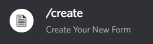
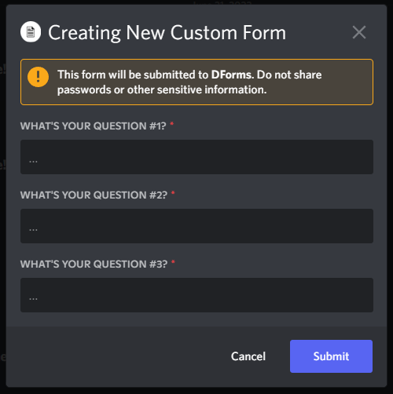
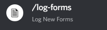
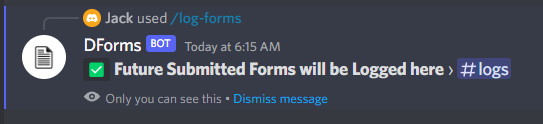
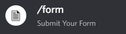
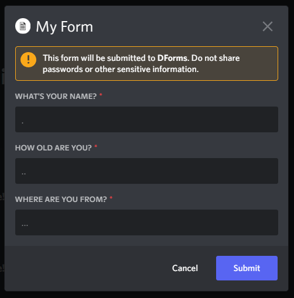
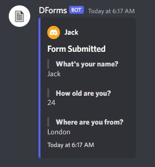
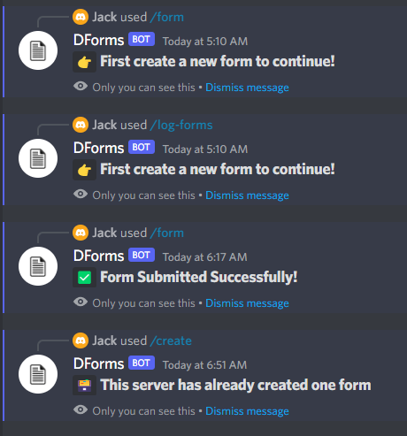

# Simple DForms - Create Forms for Your Server

## NPM Required Packages (4)
- [dotenv](https://www.npmjs.com/package/dotenv)
- [discord.js](https://www.npmjs.com/package/discord.js)
- [mongoose](https://www.npmjs.com/package/mongoose)
- [@discordjs/builders](https://www.npmjs.com/package/@discordjs/builders)

## Installing all the required packages
Using YARN
```apache
yarn
```
Using NPM
```apache
npm i
```

## File ".env" example
💡 Rename '.env.dev' to -› '.env'
```apache
DEV = true

GUILD = YOUR_GUILD_ID

MONGODB = YOUR_MONGODB_URI

TOKEN = YOUR_BOT_TOKEN
```

## Starting the bot
Using YARN
```apache
yarn dev
```
Using NPM
```apache
npm run dev
```

### Quick Links
- [Mongoose Docs](https://mongoosejs.com/docs/)
- [Download NodeJS](https://nodejs.org/en/)
- [Discord Developer Portal](https://discord.com/developers/applications)
- [MongoDB Compass GUI](https://www.mongodb.com/try/download/compass)
- [MongoDB Atlas Database](https://www.mongodb.com/atlas/database)
- [MongoDB Community Server](https://www.mongodb.com/try/download/community)

<br>

> ⚠️ `You can increase or decrease the number of questions by changing the database script and other general stuff like the text, command names and more..`

<br>

---

<br>

## 1️⃣ STEP #1
### › Run the <code>/create</code> command, fill in your questions then "Submit"
<div align="left">
	<br>
	
</div><br>

## 2️⃣ STEP #2
### › Setup your log channel with the <code>/log-forms</code> command
<div align="left">
	<br>
	
</div><br>

## 3️⃣ STEP #3
### › Run the <code>/form</code> command and fill in your answers, then "submit"
<div align="left">
	<br>
	
</div><br>

## 4️⃣ STEP #4
### › Check your log channel, and there you go!
<div align="left">
	
</div><br>

<br>

## All the bot warnings
<div align="left">
	
</div>

<br>

---